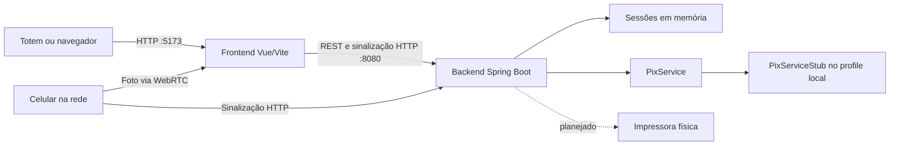

# Visão Geral da Arquitetura

## Estado Atual

O sistema é um monólito local dividido em dois processos:

- **Frontend:** Vue 3, Vue Router, Axios, QRCode e Vite.
- **Backend:** Java 17, Spring Boot 3.3.2 e Spring Web.

Não há banco de dados, mensageria, painel administrativo ou serviço real de impressão.

## Frontend

- Rotas declaradas em `src/main.js`.
- Estado da sessão em objeto reativo simples (`sessaoState.js`).
- API padrão no mesmo hostname do frontend, porta 8080.
- Foto e prévia mantidas localmente por `Blob`, `File` e URL `blob:`.
- Transferência celular → totem por canal de dados WebRTC; somente SDP passa pelo backend.
- Layouts de impressão são apenas CSS na tela de revisão.

## Backend

- `SessaoController`: cria, consulta e finaliza sessões.
- `FotoController`: negocia a conexão WebRTC e invalida sua sinalização temporária.
- `PagamentoController`: cria cobrança e consulta status.
- `SessaoService`: mantém `ConcurrentHashMap` de sessões.
- `PixService`: contrato de integração.

## Contratos REST Atuais

| Método | Rota | Função |
|---|---|---|
| POST | `/api/sessoes` | Cria sessão com produto |
| GET | `/api/sessoes/{id}` | Consulta sessão |
| POST | `/api/sessoes/{id}/finalizar` | Remove a sessão e seus metadados temporários |
| POST | `/api/sessoes/{id}/foto/celular/iniciar` | Registra oferta SDP e emite token |
| GET | `/api/sessoes/{id}/foto/celular/conexao` | Entrega a oferta SDP ao celular |
| POST | `/api/sessoes/{id}/foto/celular/conexao/responder` | Registra a resposta SDP |
| GET | `/api/sessoes/{id}/foto/celular/conexao/resposta` | Entrega a resposta SDP ao totem |
| POST | `/api/sessoes/{id}/foto/celular/conexao/concluir` | Invalida token e sinalização |
| POST | `/api/sessoes/{id}/pagamento` | Gera cobrança |
| GET | `/api/sessoes/{id}/pagamento/status` | Consulta confirmação |

## Perfis

- `local`: modo atual e `PixServiceStub` ativo.
- `cloud`: contém apenas placeholder de URL; não possui implementação de Pix ativa nem integração central funcional.

## Limitações Arquiteturais

- Reiniciar o backend perde todas as sessões.
- Reiniciar o frontend perde o estado de navegação.
- Não há separação persistente entre pedido, pagamento e impressão.
- CORS aceita qualquer origem.
- Não há autenticação, rate limit, validação completa da imagem ou tratamento global de erros.
- A conexão WebRTC atual usa somente candidatos locais, portanto exige que celular e totem consigam se comunicar na mesma rede.
- A sessão é finalizada antes de uma confirmação real de impressão.
