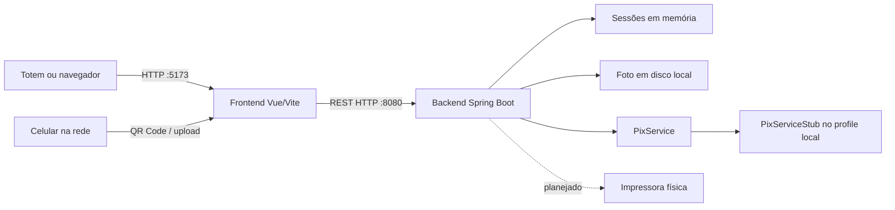

# Visão Geral da Arquitetura

## Estado Atual

O sistema é um monólito local dividido em dois processos:

- **Frontend:** Vue 3, Vue Router, Axios, QRCode e Vite.
- **Backend:** Java 17, Spring Boot 3.3.2 e Spring Web.

Não há banco de dados, mensageria, painel administrativo ou serviço real de impressão.

## Frontend

- Rotas declaradas em `src/main.js`.
- Estado da sessão em objeto reativo simples (`sessaoState.js`).
- API padrão no mesmo hostname do frontend, porta 8080.
- Prévia local por URL `blob:` ou download da imagem da sessão.
- Layouts de impressão são apenas CSS na tela de revisão.

## Backend

- `SessaoController`: cria, consulta e finaliza sessões.
- `FotoController`: recebe, entrega e remove foto; emite e valida token de upload.
- `PagamentoController`: cria cobrança e consulta status.
- `SessaoService`: mantém `ConcurrentHashMap` de sessões.
- `ArmazenamentoService`: salva em `data/sessoes/{data}/{sessaoId}/foto.jpg`.
- `PixService`: contrato de integração.

## Contratos REST Atuais

| Método | Rota | Função |
|---|---|---|
| POST | `/api/sessoes` | Cria sessão com produto |
| GET | `/api/sessoes/{id}` | Consulta sessão |
| POST | `/api/sessoes/{id}/finalizar` | Remove foto e sessão |
| POST | `/api/sessoes/{id}/foto` | Envia captura |
| GET | `/api/sessoes/{id}/foto` | Baixa a foto |
| DELETE | `/api/sessoes/{id}/foto` | Refaz a foto |
| POST | `/api/sessoes/{id}/foto/celular/iniciar` | Emite token de upload |
| POST | `/api/sessoes/{id}/foto/celular/upload` | Recebe upload com token |
| POST | `/api/sessoes/{id}/pagamento` | Gera cobrança |
| GET | `/api/sessoes/{id}/pagamento/status` | Consulta confirmação |

## Perfis

- `local`: modo atual e `PixServiceStub` ativo.
- `cloud`: contém apenas placeholder de URL; não possui implementação de Pix ativa nem integração central funcional.

## Limitações Arquiteturais

- Reiniciar o backend perde todas as sessões.
- Reiniciar o frontend perde o estado de navegação.
- Não há separação persistente entre pedido, pagamento e impressão.
- CORS aceita qualquer origem.
- Não há autenticação, rate limit, validação robusta de arquivo ou tratamento global de erros.
- A sessão é finalizada antes de uma confirmação real de impressão.
