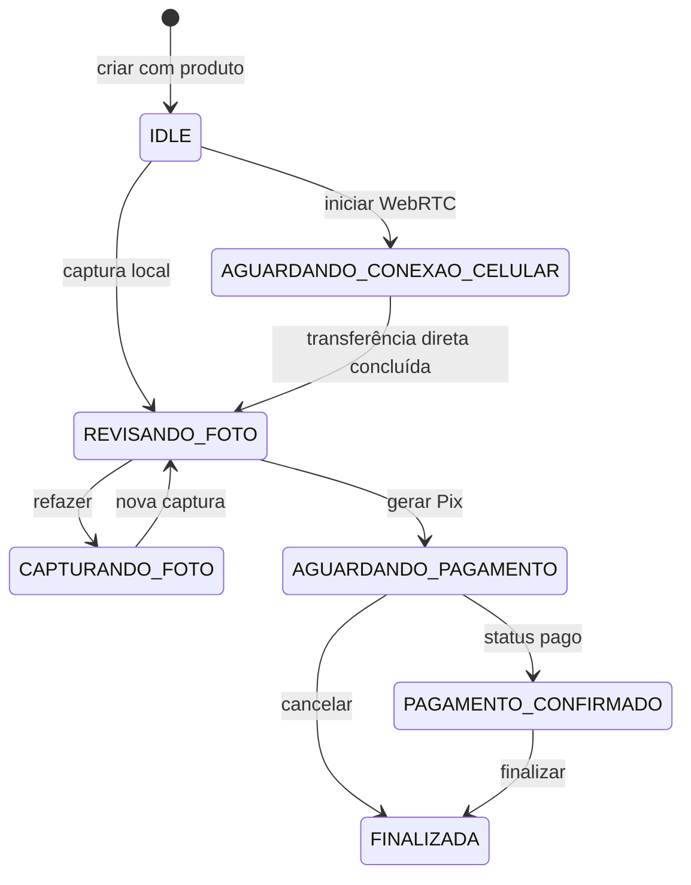

# Modelo de Domínio

## ProdutoFoto

Catálogo fechado no código atual.

| Estado Java | Descrição | Valor |
|---|---|---:|
| `POLAROID` | Polaroid | R$ 4,50 |
| `NORMAL_10X15` | Normal (10×15) | R$ 5,50 |
| `SEIS_FOTOS_3X4` | 6 fotos 3×4 | R$ 19,90 |

O preço é `BigDecimal` no backend. O frontend replica rótulos e valores para exibição.

## Sessao

Representa a interação temporária do início até finalização ou cancelamento.

### Atributos

- `id`: UUID.
- `criadaEm`: instante de criação.
- `produto`: produto imutável da sessão.
- `estado`: etapa técnica atual.
- `tokenConexaoCelular` e `tokenExpiraEm`: autorização temporária da negociação WebRTC.
- `ofertaWebRtc` e `respostaWebRtc`: sinalização SDP temporária, sem conteúdo da foto.
- `pixTxId`: identificador da cobrança.

### Estados Implementados

- `IDLE`
- `CAPTURANDO_FOTO`
- `AGUARDANDO_CONEXAO_CELULAR`
- `REVISANDO_FOTO`
- `AGUARDANDO_PAGAMENTO`
- `PAGAMENTO_CONFIRMADO`
- `IMPRIMINDO`
- `ERRO`
- `FINALIZADA`

Nem todos os estados são usados completamente. Na primeira captura a sessão vai de `IDLE` diretamente a `REVISANDO_FOTO`; `IMPRIMINDO` não é atribuído no fluxo atual.

## Foto

Não é uma entidade do backend. Durante a jornada, a imagem é um `File`/`Blob` mantido somente na memória do navegador do totem. A URL `blob:` é revogada ao refazer, cancelar ou finalizar a sessão.

## Conceitos Necessários para Produção

### Pedido

Registro persistente e imutável do produto e preço vendidos.

### Pagamento

Tentativa financeira com provedor, txId, valor, expiração, estado e eventos de conciliação.

### Impressao

Job com arquivo final, impressora, tentativas, estado, erro e confirmação física.

Separar esses conceitos evita que a exclusão de uma sessão apague a rastreabilidade de um pedido pago.

## Invariantes Desejadas

- Produto e preço não mudam depois da criação do pedido.
- Uma cobrança pertence a um pedido.
- Uma confirmação de pagamento repetida não cria outra impressão.
- Refazer substitui a foto sem criar cobrança antecipada.
- Finalizar a sessão só remove a foto após resultado da impressão ou política explícita de falha.
